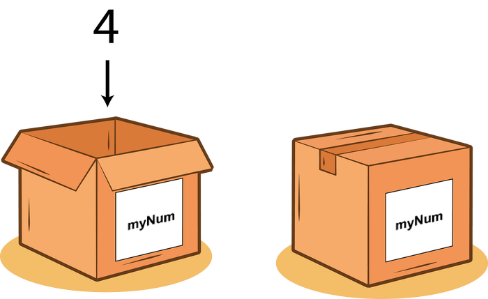

# Python for Beginners

---
<style scoped>
{
  font-size: 20px
}
</style>

# Overview

## What's covered:
+ Variables
+ Data types
+ Operations
+ Functions
+ Loops
+ If statements
+ Libraries
+ A bit about debugging...

## What's not covered:
+ Installation
+ Testing
+ Version Control
+ Code Hygiene

<!-- I understand that you may not be fully committed to using Python in your projects at the moment, and that's perfectly fine. The good news is that you don't need to install anything to get started with Python. If you *do* go ahead with using Python, I can help you with getting set up and moving on to the more advanced things you may want to do with it. -->

---
# Python Benefits

+ popular and beginner-friendly programming language
+ simple and readable syntax, resembles **psuedo-code**
+ general-purpose, can be used for a variety of applications from web development to data visualisation to generative art
+ rich ecosystem
+ interactive developments
+ community and resources
+ integration with other software

<!-- In programming, syntax refers to the set of rules and guidelines that define the structure and composition of valid code in a programming language. It determines how statements, expressions, and instructions should be written to create meaningful and executable programs. -->

<!-- Python has a simple and intuitive syntax that is easy to grasp, even for those without a programming background. It focuses on readability and provides  a gentle learning curve, allowing beginners to quickly start writing functional code. -->

<!-- Python supports interactive development environments like Jupyter Notebook and IPython, which allow for immediate feedback and experimentation. This interactivity is beneficial for artists who want to explore visualizations, generate art, or experiment with algorithms in real-time. -->

<!-- Python has a vast ecosystem of libraries and packages that cater to various domains. Artists can leverage libraries like NumPy for numerical computing, Matplotlib for data visualization, Pillow for image manipulation, and Pygame for creating interactive games and multimedia experiences. This broad range of tools empowers artists to bring their creative visions to life. -->

<!-- Python has a large and supportive community of developers, including artists and creatives. There are dedicated forums, tutorials, and online communities where beginners can seek help, share their work, and collaborate with others. The availability of resources makes it easier for artists to learn and grow their skills. -->

<!-- Python can be seamlessly integrated with other software tools commonly used in the Arts field, such as graphic design software, video editing tools, and 3D modeling applications. Python's flexibility allows artists to automate tasks, process data, and create custom workflows that bridge different software platforms. -->

<!--  Learning Python opens up a wide range of job opportunities in fields like data visualization, game development, multimedia production, and web development. The ability to combine artistic skills with programming knowledge can be highly valuable in creative industries that require technical expertise. -->

<!-- Python's simplicity, versatility, and vibrant community make it an excellent choice for beginners from an Arts background. It provides a powerful and accessible platform for artistic expression, experimentation, and collaboration, enabling artists to leverage the potential of programming in their creative pursuits. -->

---
# Examples

Examples of cool ways Python has been used in art.

---
# Setup

https://tinyurl.com/567ru9un

<!-- The easiest way to learn programming is by actually doing it. So, in today's session, we'll work on some exercises to help you wrap your mind around some of the core concepts of the Python language. At the end, I'll show you how to create a program that can download images from the web and add interesting glitch effects to images. -->

<!-- To facilitate our learning experience, we'll be utilizing a Jupyter Notebook for today's exercises. This choice offers the advantage of quick setup and simplicity. Nevertheless, it's important to note that Jupyter may not be the most suitable option for complex projects. Therefore, if you utilize Python in your professional endeavors, it's worth considering this aspect. -->

<!-- Jupyter shortcomings:
- Difficult to use with version control
- Non-linear workflow
- IDE intergration
 -->
---
# Variables

In Python, variables are containers that allow you to store and manipulate data. Think of them as labeled boxes that hold different types of information, such as numbers, text, or even complex data structures.

To create a variable, you simply choose a name for it and assign a value using the equals sign (=). For example, you can create a variable called "message" and assign it the value "Hello, World!":

```python
message = "Hello, World!"
message
```



<!-- First exercise. -->

---
# Variables - Continued

You can then use the variable in your code by referencing its name. Variables are useful because they allow you to reuse and update values without having to repeat the actual data.

Variables can hold different types of data, including integers (whole numbers), floating-point numbers (numbers with decimals), strings (text), booleans (True or False), and more. Python is a dynamically typed language.

---
# Data Types

| Data Type   | Example Declaration |
|-------------|---------------------|
| Integer     | `num = 10`          |
| Float       | `pi = 3.14`         |
| String      | `name = "John"`     |
| Boolean     | `is_true = True`    |
| List        | `my_list = [1, 2, 3]` |

Python automatically determine the type based on the assigned value.

<!-- Not included:
Tuple
Dictionary
Set
None
 -->
---
# Operations

You can perform operations on variables, such as mathematical calculations, combining strings, or comparisons. For example:

```python
x = 5
y = 3
summed = x + y  # Adds the values of x and y
greeting = "Hello, " + "World!"  # Combines two strings
is_greater = x > y  # Checks if x is greater than y
is_equal = x == y  # Checks if x and y are equal
```
---
# Functions

Functions in Python allow you to encapsulate code into reusable blocks. They are defined using the `def` keyword followed by a name and brackets.

```python
def add_numbers(a, b):
    return a + b

result = add_numbers(3, 5)
```

Parameters (or arguments) can be passed into functions, and values can be returned using the `return` statement. Functions promote code modularity, readability, and reusability. They help break down complex tasks into smaller, manageable parts.

<!-- Functions in programming can be metaphorically compared to recipes in a cookbook. Just as a recipe provides instructions for creating a dish, a function offers a set of instructions for accomplishing a specific task. The function name is akin to the recipe title, parameters serve as the ingredients, the function body represents the instructions, and the return value is analogous to the final dish. Functions, like recipes, promote reusability and modularity, allowing code to be organized and executed repeatedly throughout a program. -->
---
# If Statements

If statements allow us to selectively execute a block of code based on a condition. If the condition is true, the code block is executed; otherwise, it is skipped.

```python
x = 10

if x > 5:
    print("x is greater than 5")
else:
    print("x is not greater than 5")

```

---
# Libraries

Libraries in Python are pre-written collections of code that provide additional functionalities to the language. They contain modules, classes, and functions that can be imported into your code to extend its capabilities.

<!-- Libraries cover a wide range of domains, such as data analysis (NumPy, Pandas), web development (Django, Flask), machine learning (TensorFlow, scikit-learn), and more. By utilizing libraries, developers can save time and effort by leveraging existing solutions and building upon the work of others to enhance their Python applications. -->

---
# Errors (Advanced)

When programming in Python, encountering errors is a normal part of the learning process. Understanding these errors and being able to interpret their output is crucial for debugging and improving your code.

<!-- Error Types: Python errors can fall into different categories, such as SyntaxErrors, which occur when you violate the rules of the Python syntax, and Exceptions, which happen during runtime when an unexpected situation arises.

Error Messages: When an error occurs, Python provides an error message that gives you information about what went wrong. It typically includes the error type, a brief description of the issue, and a traceback, which shows the sequence of function calls leading to the error.

Error Locations: The traceback displays the line number and the file where the error occurred. By examining the code at that line and the surrounding context, you can identify potential causes.

Error Descriptions: The error message often provides additional details about the specific error. It might highlight a specific line of code or provide hints about the underlying issue. Reading and understanding these descriptions can guide you towards finding a solution.

Error Handling: Python allows you to handle errors using try-except blocks. By placing potentially problematic code inside a try block and providing an appropriate except block, you can catch and handle errors gracefully. This way, you can display custom error messages, take alternative actions, or log error information for future reference.

Common Errors: As a beginner, you might encounter some common errors. Examples include NameError (using an undefined variable), TypeError (incompatible data types), and IndexError (accessing a list element outside its range). Familiarizing yourself with these common errors can help you recognize them and find solutions more quickly.

Google and Stack Overflow: When faced with an error, search engines like Google and programming forums like Stack Overflow can be valuable resources. By searching for the error message or a specific symptom, you can often find explanations, solutions, or similar cases that others have encountered. -->

Remember, learning to interpret Python errors is a skill that develops over time. Embrace errors as learning opportunities and use them to understand your code better. Read the error messages carefully, examine the traceback, and consider the context of your code. With practice, you'll become more adept at identifying and resolving errors, making your coding journey smoother.

---
# Investigating an Error (Advanced)

<!-- Explain None? -->
<!-- Explain continue/break? -->

---
# Recap

+ Variables
+ Data types
+ Operations
+ Functions
+ Control structures
+ Libraries
+ Retrieving data from the web
+ Using libraries to manipulate data

---
# Learning Resources

Free interactive Python course: https://futurecoder.io
